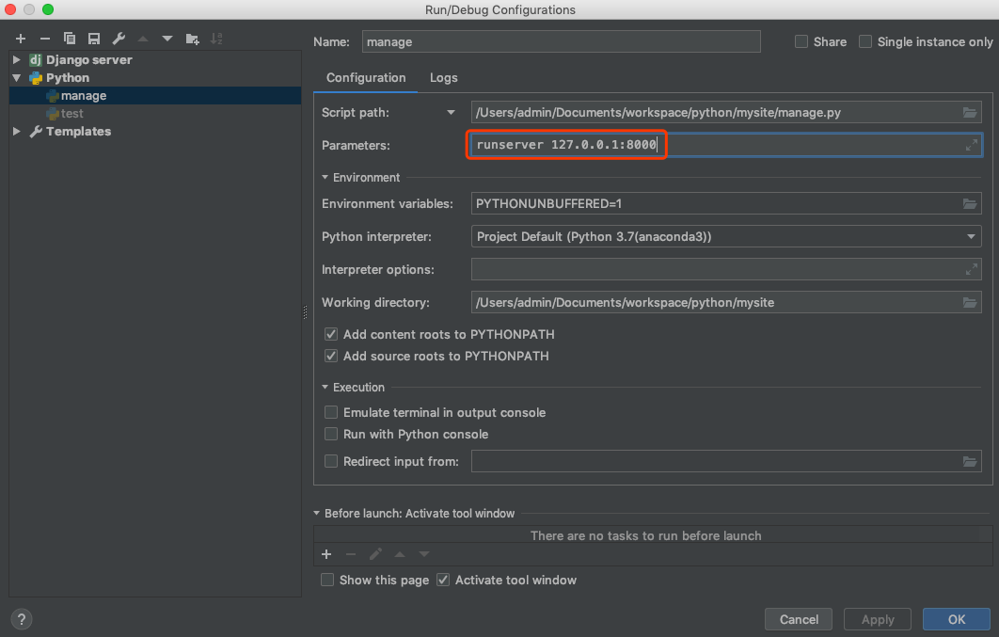

# my_music_site
python + django 搭建的一个音乐管理平台
访问```http://127.0.0.1:8000/```可以查看页面

django自带的db后台管理页面
```http://127.0.0.1:8000/admin/```
用户名/密码:```admin/123456```


#### 如果model有做修改，通过下面命令生成预修改的model脚本
``` python manage.py makemigrations ```

#### 然后再执行以下命令，修改db的表结构
``` python manage.py migrate ```

#### 创建后台登陆管理的超级用户
``` python manage.py createsuperuser ```


###启动项目
进入项目根目录，命令行执行 ``` python manage.py runserver  ```

#### 注意如果想通过pycharm的debug或者非debug模式运行，需要配置以下参数

